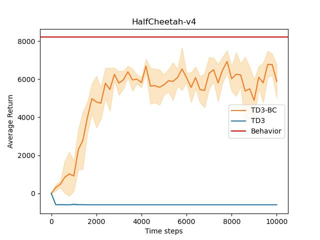
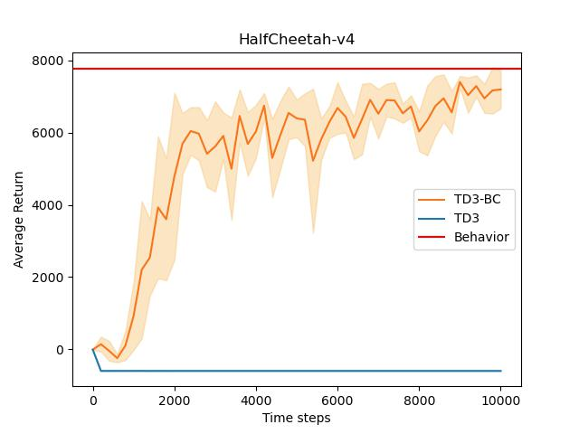

# TD3-BC

## Introduction
This is an implementation of the research paper [A Minimalist Approach to Offline Reinforcement Learning](https://arxiv.org/abs/2106.06860), which focus on the offline RL setting.

> TODO: 1. evaluate agents on D4RL 2. add pure BC in the result.

## Result
Two types of dataset were collected, which are
1. Expert demonstration
1. Imperfect demonstration

, respectively.

The datasets are generated by using similar approach to the paper [Off-Policy Deep Reinforcement Learning without Exploration](https://arxiv.org/abs/1812.02900). The expert demonstration is the same as Batch 3 in the paper, and the imperfect demonstration is the same as Batch 4 in the paper, where the expert policy (which is also the behavior policy) is trained from another project from my repo [Twin-Delayed-DDPG](https://github.com/b06b01073/Twin-Delayed-DDPG).

Both the TD3-BC agent and pure TD3 agent are trianed across 5 different seeds for 10000 steps, the agents are evaluted for every 200 steps.

### Expert demonstration

### Imperfect demonstration
